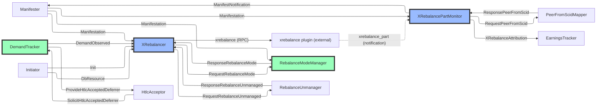

# CLBOSS Channel Balancing

Rebalance planning lives in `XRebalancer`; execution lives in the
external [`xrebalance`](https://github.com/ksedgwic/xrebalance)
plugin, which reports per-part results back via `xrebalance_part`
notifications.

